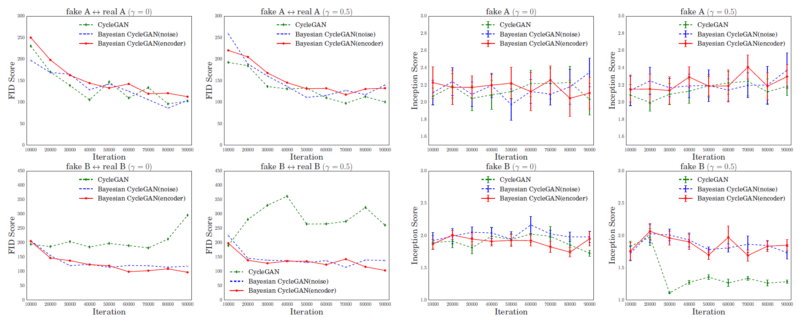
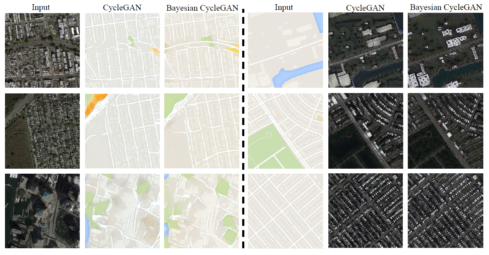
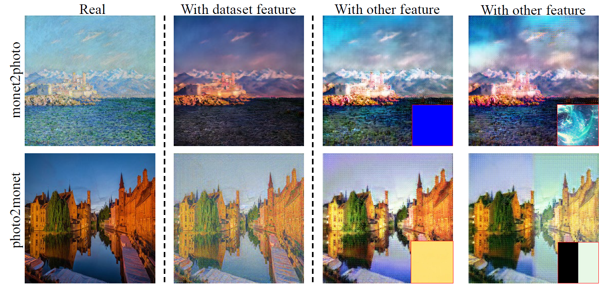
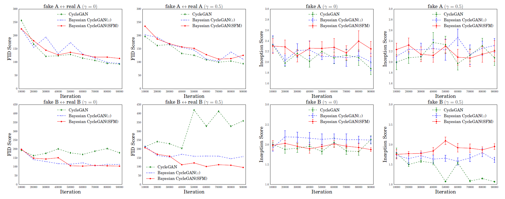

# Bayesian Cycle-consistent Adversarial Networks in PyTorch

This is the PyTorch implementation for Bayesian Cyclegan.

## Introduction

Recent techniques built on Generative Adversarial Networks (GANs) like [CycleGAN](https://arxiv.org/abs/1703.10593) are able to learn mappings between domains from unpaired datasets through min-max optimization games between generators and discriminators. However, it remains challenging to stabilize the training process and diversify generated results. To address these problems, we present the non-trivial Bayesian extension of cyclic model and an integrated cyclic framework for inter-domain mappings.

The proposed method stimulated by [Bayesian GAN](https://arxiv.org/abs/1705.09558) explores the full posteriors of Bayesian cyclic model (with latent sampling) and optimizes the model with maximum a posteriori (MAP) estimation. By exploring the full posteriors over model parameters, the Bayesian marginalization could alleviate the risk of model collapse and boost multimodal distribution learning. Besides, we deploy a combination of L1 loss and GANLoss between reconstructed images and source images to enhance the reconstructed learning, we also prove that this variation has a global optimality theoretically and show its effectiveness in experiments.

## Prerequisites
The code has the following dependencies:

- python 3.5
- torch 0.3.0
- torchvision 0.2.0
- pillow (PIL)
- NVIDIA GPU + CUDA CuDNN

Install PyTorch and dependencies on linux please follow instructions at https://pytorch.org/.
Install python libraries [visdom](https://github.com/facebookresearch/visdom) and [dominate](https://github.com/Knio/dominate).
````
pip install visdom 
pip install dominate
````

## Core training and testing options

### Training options
- `gamma`: balance factor that adjust l1-GAN loss
- `niter`: number of epoches with starting learning rate
- `niter_decay`： number of epoches with non-linearly decay learning rate to zero periodically
- `beta1`: momentum term of adam
- `lr`: initial learning rate for adam
- `no_lsgan`: do not use least square GAN if it is active
- `lambda_A`: weight for cycle loss (A -> B -> A)
- `lambda_B`: weight for cycle loss (B -> A -> B)
- `lambda_kl`: weight for KL loss
- `mc_y`: Mento Carlo samples for generate zy
- `mc_x`: Mento Carlo samples for generate zx

### Testing options
- `which_epoch`: use which model to test
- `use_feat`: if true, replace SFM to other latent variables in inference process
- `how_many`: how many test images to run

The crutial options, like `--gamma`, take control over our model, which should be set carefully. We recommend batchSize set to 1 in order to get final results, we didn't have time to test other values that may lower FCN scores.

## Usage

### Installation

1. Install the required dependencies
2. Clone this repository
3. Download corresponding datasets

### Unsupervised and Semi-supervised Learning on benchmark datasets

#### Cityscapes
* training scripts for cityscapes

````
# for cityscapes (128 x 256) using Bayesian cyclic model with noise margalization.
python train_bayes_z.py --dataroot ~/data/cityscapes --name cityscapes_bayes_L1_lsgan_noise --batchSize 1 --loadSize 256 --ratio 2 --netG_A global --netG_B global --ngf 32 --num_D_A 1 --num_D_B 1 --mc_x 3 --mc_y 3 --n_blocks_global 6 --n_downsample_global 2 --niter 50 --niter_decay 50 --gamma 0 --lambda_kl 0.1
````

If you want to use Bayesian model with encoder margalization, you only need to change `train_bayes_z.py` to `train_bayes.py`. By the same token, you can set `--gamma` to 0.5 if you want use L1 loss combined with GANLoss in the recycled learning.

* continue train

If your machine encounters some questions and stops work, you may need revive machanism to help you. In our train scripts, you should change the `start_epoch` and `epoch_iter` to that cut point and continue train by adding the following clause to the command:
````
--continue_train --which_epoch latest
````

* testing scripts for cityscapes

````
python test_bayes_z.py --dataroot ~/data/cityscapes --name cityscapes_bayes_L1_lsgan --phase test --loadSize 256 --ratio 2 --netG_A global --netG_B global --ngf 32 --n_blocks_global 6 --n_downsample_global 2 --which_epoch latest --how_many 500
````
You can choose which model to use by reset the option `--which_epoch`.

* Pre-trained model

Our latest model are avaliable in [Google drive](https://drive.google.com/open?id=1C4W3xJ8kiqtDVnMmflSsmlxsfv_BIVWH)

#### result display

- Final qualitative results samples for Bayesian cyclic model in unsupervised setting under condition `gamma = 0`


- Comparison about model stability: When `gamma = 0.5`, our method maintain stable convergence while the original one collapses to one distribution for photo2label task.


- FID and Inception score


- FID and Inception score for reconstructed learning


- FCN scores
In our experiment, we use Bayesian cyclic model with random noise marginalization for the first 100 epoches, and finetune the model with SFM latent sampling for the later 100 epoches. The results show that Bayesian version cyclic model outperform original one.

<table>
	<tr>
		<th>Methods</th>
		<th>Per-pixel acc.</th>
		<th>Per-class acc.</th>
		<th>Class IOU</th>
	</tr>
	<tr>
		<th>CycleGAN (dropout)</th>
		<th>0.56</th>
		<th>0.18</th>
		<th>0.12</th>
	</tr>
	<tr>
		<th>CycleGAN (buffer)</th>
		<th>0.58</th>
		<th>0.22</th>
		<th>0.16</th>
	</tr>
	<tr>
		<th>Bayesian CycleGAN</th>
		<th>0.73</th>
		<th>0.27</th>
		<th>0.20</th>
	</tr>
	<tr>
		<th>Pix2pix (supervised)</th>
		<th>0.85</th>
		<th>0.40</th>
		<th>0.32</th>
	</tr>
</table>

#### Maps
The training command are similar with cityscapes, but you should notice that the figures' size of Maps are resized to 256x256, consequently, `--ratio` should be 1. The results are illustrated as:


#### Monet2Photo
Art mapping is a kind of image style transfer, This dataset is crawled from Wikiart.org and Flickr by Junyan Zhu et all., which contains 1074 Monet artwork and 6853 Photographs. Interestingly, if we imposed restriction on latent space by using the encoder network to generate statistic feature map, Bayesian cyclic model could generate diversified images by replacing SFM with other features in inference process.

In our implementation, we use option `--use_feat` in inference procedure to let us change statistic feature map to any other pictures stored at `/dataroot/feat`. The results illustrated as follow:



#### Semi-supervised learning

In cases where paired data is accessible, we can lever-age the condition to train our model in a semi-supervisedsetting. In the training process ofCityscapes, mapping errors often occur, for example, the Gaussian initial model cannot recognize trees, thus, trans-lating trees into something else due to the unsupervised set-ting. To resolve these ambiguities requires weak semanticsupervision, we can use 30 (around 1%) paired data (pictures of cityscape and corresponding label images) to initialize our model at the beginning for each epoch. 

* FID and Inception score



## Acknowledgement
Code is inspired by [CycleGAN](https://github.com/junyanz/CycleGAN).